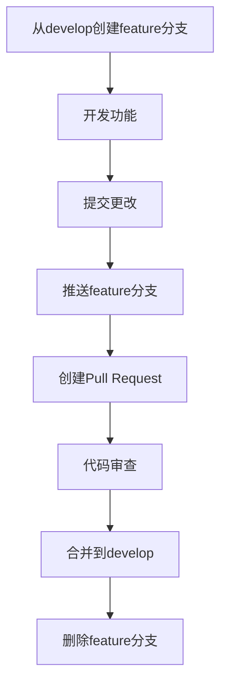
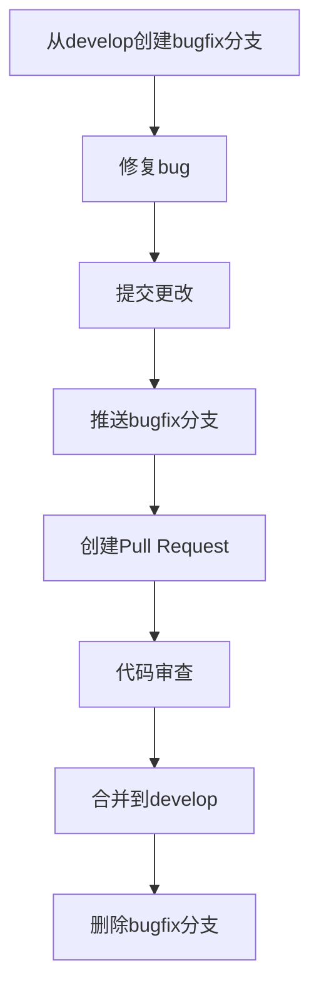
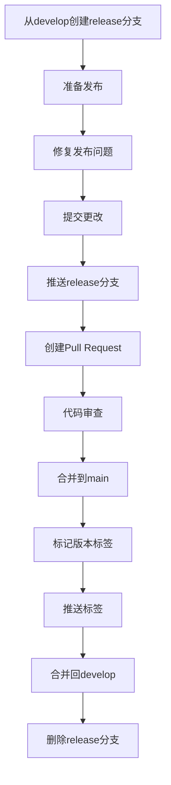

# Git Pushing 技能模板

## 1. 技术概述

### 1.1 技能简介
Git Pushing 是一个可重用的技能模板，提供标准化的Git操作流程，包括仓库初始化、分支管理、提交信息格式化、推送操作、错误处理和冲突解决。

### 1.2 技术栈
- **版本控制**：Git 2.0+
- **操作系统**：Windows, macOS, Linux
- **支持的终端**：PowerShell, Bash, Zsh

### 1.3 核心功能
- Git仓库初始化和配置
- 分支创建、切换和管理
- 标准化提交信息格式
- 智能推送操作
- 错误处理和冲突解决
- 工作流集成

## 2. 环境配置指南

### 2.1 Git安装

#### Windows
```powershell
# 方法1：使用Chocolatey安装（推荐）
choco install git

# 方法2：从官网下载安装
# https://git-scm.com/download/win
```

#### macOS
```bash
# 方法1：使用Homebrew安装
brew install git

# 方法2：使用Xcode命令行工具
xcode-select --install
```

#### Linux
```bash
# Ubuntu/Debian
sudo apt update && sudo apt install git

# CentOS/RHEL
sudo yum install git

# Fedora
sudo dnf install git
```

### 2.2 Git配置

```bash
# 配置用户名和邮箱
git config --global user.name "Your Name"
git config --global user.email "your.email@example.com"

# 配置默认编辑器
git config --global core.editor "code --wait"  # VS Code
git config --global core.editor "nano"          # Nano

# 配置换行符处理
git config --global core.autocrlf true          # Windows
git config --global core.autocrlf input         # macOS/Linux

# 启用颜色
git config --global color.ui true
```

## 3. 标准化Git工作流程

### 3.1 仓库初始化

```bash
# 初始化新仓库
git init <repository-name>
cd <repository-name>

# 克隆现有仓库
git clone <repository-url>
cd <repository-name>

# 配置远程仓库（如果需要）
git remote add origin <repository-url>
```

### 3.2 分支管理

#### 分支命名规范
- `main`/`master` - 主分支
- `develop` - 开发分支
- `feature/<feature-name>` - 功能分支
- `bugfix/<bug-name>` - bug修复分支
- `hotfix/<fix-name>` - 紧急修复分支
- `release/<version>` - 发布分支

#### 分支操作
```bash
# 查看所有分支
git branch -a

# 创建新分支
git checkout -b <branch-name>

# 切换分支
git checkout <branch-name>

# 合并分支（在目标分支上执行）
git merge <source-branch>

# 删除本地分支（已合并）
git branch -d <branch-name>

# 删除本地分支（强制）
git branch -D <branch-name>

# 删除远程分支
git push origin --delete <branch-name>
```

### 3.3 提交信息格式化

#### 提交信息结构
```
<类型>(<范围>): <主题>

<正文>

<页脚>
```

#### 提交类型
- `feat` - 新功能
- `fix` - bug修复
- `docs` - 文档变更
- `style` - 代码风格变更（不影响功能）
- `refactor` - 代码重构
- `perf` - 性能优化
- `test` - 测试相关
- `build` - 构建系统变更
- `ci` - CI配置变更
- `chore` - 其他变更

#### 提交示例
```bash
# 功能提交
git commit -m "feat(auth): 添加用户登录功能

添加JWT认证支持，包括登录、注册和令牌验证"

# Bug修复提交
git commit -m "fix(api): 修复用户数据获取错误

修复了GET /users接口在处理空数据时的崩溃问题"

# 文档提交
git commit -m "docs(readme): 更新项目README.md

添加了安装说明和使用示例"
```

### 3.4 推送操作

```bash
# 推送当前分支到远程
git push

# 推送指定分支到远程
git push origin <branch-name>

# 首次推送新分支
git push -u origin <branch-name>

# 推送所有分支
git push --all origin

# 推送标签
git push --tags
```

### 3.5 拉取更新

```bash
# 拉取当前分支的更新
git pull

# 拉取指定分支的更新
git pull origin <branch-name>

# 拉取并重新基于远程分支
git pull --rebase origin <branch-name>
```

## 4. 错误处理和冲突解决

### 4.1 常见错误处理

#### 推送被拒绝
```bash
# 错误：Updates were rejected because the remote contains work that you do not have locally

# 解决方案1：先拉取更新再推送
git pull --rebase
git push

# 解决方案2：强制推送（谨慎使用）
git push --force
```

#### 合并冲突
```bash
# 错误：CONFLICT (content): Merge conflict in <file>

# 解决方案：
# 1. 手动编辑冲突文件，解决冲突标记
# 2. 标记冲突已解决
git add <file>
# 3. 完成合并
git commit
```

#### 提交历史问题
```bash
# 撤销最后一次提交（保留更改）
git reset HEAD~1

# 撤销最后一次提交（丢弃更改）
git reset --hard HEAD~1

# 修改最后一次提交信息
git commit --amend
```

### 4.2 冲突解决策略

#### 文本文件冲突
1. 识别冲突标记：`<<<<<<<`, `=======`, `>>>>>>>`
2. 分析冲突内容
3. 选择保留的更改或合并两者
4. 删除冲突标记
5. 标记文件为已解决并提交

#### 二进制文件冲突
```bash
# 保留本地版本
git checkout --ours <file>
git add <file>

# 保留远程版本
git checkout --theirs <file>
git add <file>
```

## 5. 工作流集成

### 5.1 功能开发工作流



### 5.2 Bug修复工作流



### 5.3 发布工作流



## 6. 最佳实践

### 6.1 提交最佳实践
- 每个提交应该是一个逻辑单元
- 提交信息应该清晰、简洁、描述性
- 避免大型提交，将更改分解为 smaller 提交
- 提交前运行测试确保代码质量
- 使用 `.gitignore` 文件排除不需要版本控制的文件

### 6.2 分支管理最佳实践
- 定期从主分支拉取更新
- 保持分支生命周期短
- 及时删除已合并的分支
- 为每个功能或bug使用单独的分支
- 遵循一致的分支命名约定

### 6.3 推送最佳实践
- 推送前检查代码是否通过测试
- 推送前确保没有敏感信息
- 使用语义化版本标签
- 定期清理远程分支
- 配置合理的推送策略

## 7. 输入输出规范

### 7.1 输入规范

#### 仓库初始化
- **输入**：仓库名称或远程URL
- **格式**：字符串
- **示例**：`my-project` 或 `https://github.com/user/repo.git`

#### 分支操作
- **输入**：分支名称
- **格式**：字符串，遵循分支命名规范
- **示例**：`feature/authentication`

#### 提交操作
- **输入**：提交信息
- **格式**：字符串，遵循提交信息规范
- **示例**：`feat(auth): 添加用户登录功能`

#### 推送操作
- **输入**：远程名称和分支名称（可选）
- **格式**：字符串
- **示例**：`origin main`

### 7.2 输出规范

#### 成功操作
- **输出**：操作结果和状态信息
- **格式**：字符串
- **示例**：`✓ 推送成功: main -> origin/main`

#### 错误操作
- **输出**：错误信息和建议解决方案
- **格式**：字符串
- **示例**：`✗ 推送失败: 远程包含本地不存在的更改。建议：先拉取更新再推送。`

#### 冲突解决
- **输出**：冲突文件列表和解决建议
- **格式**：字符串
- **示例**：`⚠ 检测到冲突: src/file.js。请解决冲突后再提交。`

## 8. 验证检查

### 8.1 前置检查
- Git 是否已安装并配置
- 当前目录是否为Git仓库
- 远程仓库是否可访问
- 工作区是否有未提交的更改

### 8.2 提交前检查
- 代码是否通过测试
- 是否有未跟踪的文件
- 是否有敏感信息
- 提交信息是否符合规范

### 8.3 推送前检查
- 本地分支是否与远程分支同步
- 是否有合并冲突
- CI/CD 配置是否正确
- 版本标签是否已更新（如需）

## 9. 使用场景示例

### 9.1 新功能开发

**场景**：开发一个新的用户认证功能

**步骤**：
1. 从develop分支创建feature分支
2. 实现认证功能
3. 运行测试确保代码质量
4. 提交更改，使用标准化的提交信息
5. 推送feature分支到远程
6. 创建Pull Request进行代码审查
7. 合并到develop分支
8. 删除feature分支

**示例命令**：
```bash
# 1. 创建feature分支
git checkout develop
git pull
git checkout -b feature/authentication

# 2-3. 实现功能并测试
# ... 开发代码 ...
npm test

# 4. 提交更改
git add .
git commit -m "feat(auth): 添加用户认证功能

添加了基于JWT的用户认证系统，包括登录、注册和令牌验证功能"

# 5. 推送分支
git push -u origin feature/authentication

# 6-8. 创建PR、审查、合并、删除分支
# ... 在GitHub/GitLab上操作 ...
```

### 9.2 Bug修复

**场景**：修复一个API响应错误

**步骤**：
1. 从develop分支创建bugfix分支
2. 定位并修复bug
3. 测试修复效果
4. 提交更改
5. 推送分支并创建Pull Request
6. 合并到develop分支
7. 删除bugfix分支

**示例命令**：
```bash
# 1. 创建bugfix分支
git checkout develop
git pull
git checkout -b bugfix/api-response

# 2-3. 修复bug并测试
# ... 修复代码 ...
npm test

# 4. 提交更改
git add .
git commit -m "fix(api): 修复响应格式错误

修复了API返回的JSON格式错误，确保所有端点返回有效的JSON"

# 5. 推送分支
git push -u origin bugfix/api-response

# 6-7. 创建PR、合并、删除分支
# ... 在GitHub/GitLab上操作 ...
```

### 9.3 发布版本

**场景**：发布1.0.0版本

**步骤**：
1. 从develop分支创建release分支
2. 更新版本号和发布说明
3. 测试发布版本
4. 提交更改
5. 推送分支并创建Pull Request
6. 合并到main分支
7. 创建版本标签
8. 推送标签
9. 合并回develop分支
10. 删除release分支

**示例命令**：
```bash
# 1. 创建release分支
git checkout develop
git pull
git checkout -b release/1.0.0

# 2-3. 更新版本号并测试
# ... 更新版本号 ...
npm test

# 4. 提交更改
git add .
git commit -m "build: 准备1.0.0版本发布

更新了版本号和发布说明"

# 5. 推送分支
git push -u origin release/1.0.0

# 6. 合并到main
# ... 在GitHub/GitLab上操作 ...

# 7-8. 创建并推送标签
git checkout main
git pull
git tag -a v1.0.0 -m "版本1.0.0发布"
git push --tags

# 9. 合并回develop
git checkout develop
git merge main

# 10. 删除release分支
git branch -d release/1.0.0
git push origin --delete release/1.0.0
```

## 10. 工具和脚本

### 10.1 辅助脚本

#### 提交信息验证脚本
```bash
#!/bin/bash

# 验证提交信息格式
commit_msg_file=$1
commit_msg=$(cat "$commit_msg_file")

# 检查是否符合格式要求
if [[ ! "$commit_msg" =~ ^(feat|fix|docs|style|refactor|perf|test|build|ci|chore)\(.*\):.*$ ]]; then
    echo "错误：提交信息不符合规范"
    echo "正确格式：<类型>(<范围>): <主题>"
    exit 1
fi

exit 0
```

#### Git工作流脚本
```bash
#!/bin/bash

# 功能：创建新的feature分支
function create_feature() {
    local feature_name=$1
    git checkout develop
    git pull
    git checkout -b "feature/$feature_name"
    echo "已创建并切换到分支：feature/$feature_name"
}

# 功能：创建新的bugfix分支
function create_bugfix() {
    local bug_name=$1
    git checkout develop
    git pull
    git checkout -b "bugfix/$bug_name"
    echo "已创建并切换到分支：bugfix/$bug_name"
}

# 功能：准备发布
function prepare_release() {
    local version=$1
    git checkout develop
    git pull
    git checkout -b "release/$version"
    echo "已创建并切换到分支：release/$version"
}

# 显示帮助信息
function show_help() {
    echo "Git工作流脚本"
    echo "用法："
    echo "  ./git-workflow.sh feature <name>    # 创建feature分支"
    echo "  ./git-workflow.sh bugfix <name>     # 创建bugfix分支"
    echo "  ./git-workflow.sh release <version> # 创建release分支"
}

# 主函数
function main() {
    case $1 in
        feature)
            create_feature $2
            ;;
        bugfix)
            create_bugfix $2
            ;;
        release)
            prepare_release $2
            ;;
        help|--help|-h)
            show_help
            ;;
        *)
            show_help
            exit 1
            ;;
    esac
}

# 执行主函数
main "$@"
```

### 10.2 Git钩子

#### 提交前钩子（pre-commit）
```bash
#!/bin/sh

# 运行测试
if ! npm test; then
    echo "测试失败，提交被拒绝"
    exit 1
fi

# 检查代码风格
if ! npx eslint .; then
    echo "代码风格检查失败，提交被拒绝"
    exit 1
fi

exit 0
```

#### 提交信息钩子（commit-msg）
```bash
#!/bin/sh

# 使用验证脚本
./scripts/validate-commit-msg.sh "$1"
```

## 11. 常见问题解答

### 11.1 推送相关问题

#### Q: 推送被拒绝，提示远程包含本地不存在的更改
**A:** 先拉取远程更新，解决可能的冲突，然后再推送：
```bash
git pull --rebase
git push
```

#### Q: 如何强制推送更改
**A:** 使用 `--force` 选项（谨慎使用，可能覆盖远程更改）：
```bash
git push --force
```

### 11.2 分支相关问题

#### Q: 如何重命名分支
**A:** 
```bash
# 重命名本地分支
git branch -m old-name new-name

# 推送新分支并删除旧分支
git push origin new-name
git push origin --delete old-name

# 更新本地跟踪分支
git branch --set-upstream-to=origin/new-name
```

#### Q: 如何查看分支的创建时间
**A:** 
```bash
git for-each-ref --sort=creatordate --format='%(refname:short) %(creatordate)' refs/heads/
```

### 11.3 提交相关问题

#### Q: 如何撤销已推送的提交
**A:** 
```bash
# 方法1：创建新提交来撤销更改
git revert <commit-hash>
git push

# 方法2：重置分支并强制推送（谨慎使用）
git reset --hard <commit-hash>
git push --force
```

#### Q: 如何查看提交历史
**A:** 
```bash
# 查看简洁历史
git log --oneline

# 查看详细历史
git log

# 查看特定文件的历史
git log -- <file>
```

## 12. 总结

Git Pushing 技能模板提供了标准化的Git操作流程，帮助开发者：

- 遵循最佳实践进行版本控制
- 保持一致的提交历史和分支结构
- 有效处理错误和冲突
- 集成到常见的开发工作流中

通过使用本模板，开发者可以提高代码质量、协作效率和项目可维护性，同时减少Git相关的错误和问题。