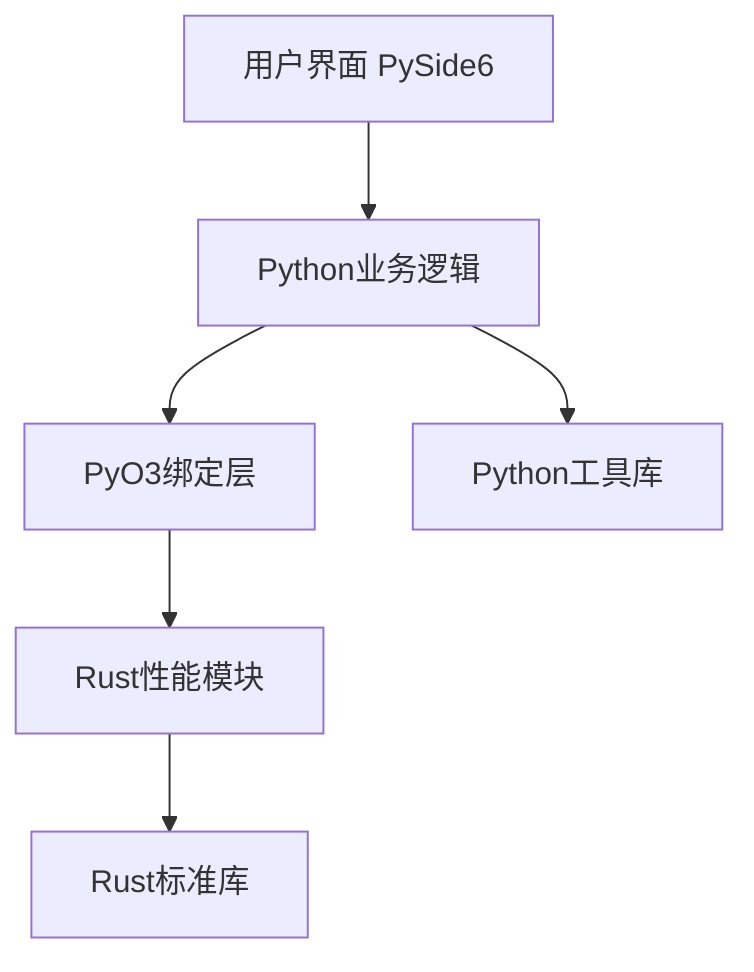

# SAS - 系统分析和设计

## 1. 技术概述

### 1.1 技能简介
SAS (System Analysis and Design) 是一个专为个人项目及小型团队设计的系统分析和设计框架，专注于客户端桌面程序或命令行应用开发。

### 1.2 技术栈
- **主要语言**: Python 3.10+ + Rust 1.70+
- **GUI框架**: PySide6 6.5+
- **语言绑定**: PyO3
- **开发模式**: Python为主，性能敏感模块使用Rust实现

### 1.3 核心架构
- Python负责业务逻辑、GUI交互和快速开发
- Rust负责性能敏感模块（如数据处理、计算密集型任务）
- PyO3实现Python与Rust的无缝集成
- 模块化设计，便于扩展和维护

## 2. 环境配置指南

### 2.1 开发环境搭建

#### 2.1.1 Python环境
```bash
# 安装Python 3.10+
python -m venv venv
.\venv\Scripts\activate  # Windows
# source venv/bin/activate  # Linux/Mac

# 安装PySide6
pip install pyside6>=6.5.0
```

#### 2.1.2 Rust环境
```bash
# 安装Rust
curl --proto '=https' --tlsv1.2 -sSf https://sh.rustup.rs | sh

# 配置Rust工具链
rustup default stable
rustup update
```

#### 2.1.3 PyO3开发环境
```bash
# 在Rust项目中添加PyO3依赖
cargo add pyo3 --features extension-module

# 安装maturin用于构建Python包
pip install maturin
```

### 2.2 项目结构

```
project/
├── src/
│   ├── python/           # Python代码
│   │   ├── main.py       # 主入口
│   │   ├── gui/          # GUI组件
│   │   └── business/     # 业务逻辑
│   └── rust/             # Rust代码
│       ├── src/
│       │   └── lib.rs    # Rust库
│       └── Cargo.toml    # Rust依赖
├── pyproject.toml        # Python项目配置
└── maturin.toml          # Maturin配置
```

## 3. 架构设计说明

### 3.1 系统架构图



### 3.2 组件交互

| 组件 | 职责 | 技术实现 |
|------|------|----------|
| 用户界面 | 提供可视化交互 | PySide6 |
| 业务逻辑 | 处理核心业务流程 | Python |
| 性能模块 | 处理计算密集型任务 | Rust |
| 绑定层 | 连接Python与Rust | PyO3 |
| 数据存储 | 持久化数据 | Python库（如SQLAlchemy）或Rust库 |

## 4. Python与Rust模块划分原则

### 4.1 Python适用场景
- 业务逻辑实现
- GUI开发与交互
- 快速原型开发
- 与外部Python库集成
- 非性能敏感的工具函数

### 4.2 Rust适用场景
- 数据处理和转换
- 计算密集型算法
- 内存敏感操作
- 并发和并行处理
- 底层系统交互

### 4.3 划分决策流程
1. 分析功能需求和性能要求
2. 评估开发复杂度和维护成本
3. 考虑团队技术栈熟悉度
4. 优先使用Python实现，性能瓶颈使用Rust优化

## 5. PyO3绑定实现方法

### 5.1 基本绑定示例

#### Rust端（src/rust/src/lib.rs）
```rust
use pyo3::prelude::*;

/// 计算斐波那契数列（Rust实现）
#[pyfunction]
fn fibonacci(n: u32) -> u64 {
    if n <= 1 {
        return n as u64;
    }
    fibonacci(n - 1) + fibonacci(n - 2)
}

/// Python模块定义
#[pymodule]
fn myrustlib(_py: Python, m: &PyModule) -> PyResult<()> {
    m.add_function(wrap_pyfunction!(fibonacci, m)?)?;
    Ok(())
}
```

#### Python端调用
```python
import myrustlib

# 调用Rust实现的斐波那契函数
result = myrustlib.fibonacci(40)
print(f"Fibonacci(40) = {result}")
```

### 5.2 构建与安装

```bash
# 在项目根目录构建
maturin develop --release
```

## 6. 性能优化策略

### 6.1 性能瓶颈识别
- 使用Python的cProfile进行性能分析
- 使用Rust的criterion进行基准测试
- 监控内存使用情况

### 6.2 优化方法

#### 6.2.1 Python侧优化
- 使用生成器和迭代器减少内存使用
- 避免不必要的对象创建
- 使用NumPy等优化库处理数据

#### 6.2.2 Rust侧优化
- 使用合适的数据结构
- 利用Rust的所有权系统避免不必要的拷贝
- 使用并行处理（rayon库）
- 启用编译器优化（--release构建）

#### 6.2.3 跨语言调用优化
- 减少Python与Rust之间的数据传输
- 使用批量处理减少调用次数
- 避免在热路径上进行跨语言调用

## 7. 最佳实践与常见问题解答

### 7.1 最佳实践

#### 7.1.1 代码组织
- 保持Python和Rust代码分离
- 清晰定义模块边界和接口
- 使用类型注解提高代码可读性和可维护性

#### 7.1.2 测试策略
- Python代码使用pytest测试
- Rust代码使用cargo test测试
- 集成测试验证跨语言调用

#### 7.1.3 版本管理
- 明确Python和Rust的版本依赖
- 使用pyproject.toml和Cargo.toml管理依赖
- 定期更新依赖版本

### 7.2 常见问题解答

#### 7.2.1 PyO3构建失败
**问题**：maturin develop失败，提示缺少依赖
**解决方案**：确保安装了所有系统依赖，如gcc、libssl等

#### 7.2.2 性能提升不明显
**问题**：使用Rust替换Python代码后性能提升不明显
**解决方案**：
- 检查是否在热路径上调用Rust函数
- 优化数据传输方式
- 确保Rust代码本身已优化

#### 7.2.3 内存管理问题
**问题**：跨语言调用导致内存泄漏
**解决方案**：
- 确保正确处理Python对象的引用计数
- 使用PyO3的安全API
- 避免循环引用

## 8. 输出文档模板

所有输出文档模板请参考 `templates/` 目录下的文件，包括：
- `requirement_analysis.md.j2`：需求分析文档模板
- `functional_design.md.j2`：功能设计文档模板
- `nonfunctional_requirements.md.j2`：非功能需求文档模板
- `architecture_design.md.j2`：架构设计文档模板
- `technology_selection.md.j2`：技术选型报告模板
- `implementation_roadmap.md.j2`：项目实施路线图模板

## 9. 示例案例

示例案例请参考 `examples/` 目录下的文件，展示如何使用本框架分析和设计客户端应用。
