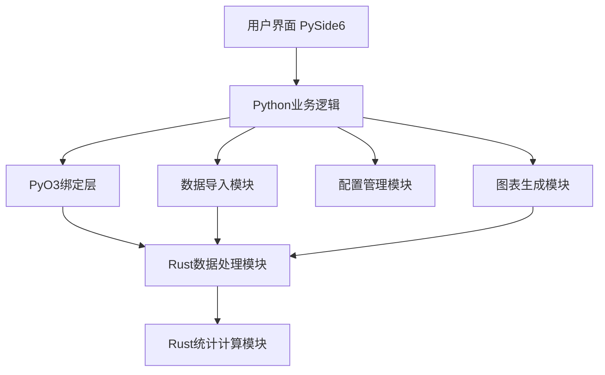

# 桌面应用系统分析示例

## 1. 项目概述

本案例展示了如何使用SAS框架分析一个桌面应用项目。该项目是一个数据可视化工具，用于分析和展示CSV格式的数据，支持多种图表类型和数据处理功能。

## 2. 需求分析

### 2.1 功能需求

| 需求ID | 需求描述 | 优先级 | 技术实现 |
|--------|----------|--------|----------|
| FR001 | 支持CSV文件导入 | 高 | Python |
| FR002 | 数据预览和基本统计 | 高 | Python |
| FR003 | 数据过滤和排序 | 中 | Python |
| FR004 | 多种图表生成（折线图、柱状图、饼图） | 高 | Python + PySide6 |
| FR005 | 大数据集处理（>100万行） | 中 | Rust |
| FR006 | 图表导出（PNG、PDF） | 中 | Python |
| FR007 | 配置保存和加载 | 中 | Python |

### 2.2 非功能需求

| 需求ID | 需求描述 | 验收标准 | 技术实现 |
|--------|----------|----------|----------|
| NFR001 | 启动时间 | <2秒 | Python + 优化的Rust模块 |
| NFR002 | 大数据集处理 | 100万行数据加载时间 <5秒 | Rust |
| NFR003 | 图表渲染 | 响应时间 <1秒 | Python + PySide6 |
| NFR004 | 内存使用 | 处理100万行数据内存占用 <500MB | Rust |

## 3. 架构设计

### 3.1 系统架构图



### 3.2 模块划分

| 模块 | 功能 | 技术实现 | 理由 |
|------|------|----------|------|
| 用户界面 | 提供可视化交互 | PySide6 | 快速开发，丰富的UI组件 |
| 数据导入 | CSV文件解析和导入 | Python | 开发效率高，库支持丰富 |
| 图表生成 | 生成各种类型的图表 | Python + PySide6 | 成熟的图表库支持 |
| 配置管理 | 保存和加载用户配置 | Python | 简单的数据处理，无需高性能 |
| 数据处理 | 大数据集处理和转换 | Rust | 高性能，内存效率高 |
| 统计计算 | 复杂的统计计算 | Rust | 计算密集型任务，性能要求高 |

## 4. PyO3绑定实现

### 4.1 Rust模块设计

#### 4.1.1 Cargo.toml
```toml
[package]
name = "data_processor"
version = "0.1.0"
edition = "2021"

[dependencies]
pyo3 = { version = "0.21.0", features = ["extension-module"] }
ndarray = "0.15.6"
numpy = "0.17.1"
serde = { version = "1.0.193", features = ["derive"] }
```

#### 4.1.2 lib.rs
```rust
use ndarray::Array2;
use pyo3::prelude::*;
use serde::Deserialize;

/// 数据处理结果
#[derive(Debug, Deserialize)]
pub struct DataStats {
    pub rows: usize,
    pub columns: usize,
    pub mean: Vec<f64>,
    pub median: Vec<f64>,
    pub std_dev: Vec<f64>,
}

/// 加载和处理CSV数据
#[pyfunction]
pub fn load_csv(data: &str) -> PyResult<(Vec<Vec<String>>, DataStats)> {
    // 解析CSV数据
    let mut reader = csv::Reader::from_reader(data.as_bytes());
    let headers = reader.headers()?.clone().into_iter().collect::<Vec<_>>();
    let mut rows = Vec::new();
    
    for result in reader.records() {
        let record = result?;
        rows.push(record.into_iter().collect::<Vec<_>>());
    }
    
    // 计算统计信息
    let stats = calculate_stats(&rows);
    
    Ok((vec![headers.into_iter().map(|h| h.to_string()).collect()], stats))
}

/// 计算数据统计信息
fn calculate_stats(rows: &[Vec<&str>]) -> DataStats {
    // 实现统计计算逻辑
    // ...
}

/// Python模块定义
#[pymodule]
pub fn data_processor(_py: Python, m: &PyModule) -> PyResult<()> {
    m.add_function(wrap_pyfunction!(load_csv, m)?)?;
    Ok(())
}
```

### 4.2 Python调用示例

```python
from PySide6.QtWidgets import QApplication, QMainWindow, QFileDialog
from data_processor import load_csv
import sys

class DataVisualizerApp(QMainWindow):
    def __init__(self):
        super().__init__()
        self.setWindowTitle("数据可视化工具")
        self.setup_ui()
    
    def setup_ui(self):
        # 设置UI组件
        # ...
    
    def import_csv(self):
        # 打开文件选择对话框
        file_path, _ = QFileDialog.getOpenFileName(self, "打开CSV文件", "", "CSV Files (*.csv)")
        if file_path:
            with open(file_path, 'r') as f:
                data = f.read()
            
            # 调用Rust模块处理数据
            headers, stats = load_csv(data)
            
            # 处理结果
            self.display_data(headers, stats)

def main():
    app = QApplication(sys.argv)
    window = DataVisualizerApp()
    window.show()
    sys.exit(app.exec())

if __name__ == "__main__":
    main()
```

## 5. 性能优化策略

### 5.1 数据处理优化

1. **Rust并行处理**：使用rayon库实现数据并行处理
2. **内存优化**：使用ndarray库进行高效的数值计算
3. **批量处理**：将大数据集分成小块处理，减少内存占用

### 5.2 跨语言调用优化

1. **减少调用次数**：每次调用处理整个数据集，而不是逐行处理
2. **高效数据传输**：使用numpy数组进行数据传输，避免Python列表的序列化开销
3. **缓存机制**：对频繁使用的数据结果进行缓存

## 6. 项目实施计划

### 6.1 迭代计划

| 迭代 | 周期 | 主要功能 |
|------|------|----------|
| 迭代1 | 2周 | 项目初始化、基本UI框架、CSV导入 |
| 迭代2 | 2周 | 数据预览、基本统计、简单图表 |
| 迭代3 | 2周 | Rust数据处理模块集成、大数据集支持 |
| 迭代4 | 1周 | 高级图表类型、图表导出 |
| 迭代5 | 1周 | 配置管理、测试和优化 |

### 6.2 资源分配

| 角色 | 人数 | 主要职责 |
|------|------|----------|
| 开发人员 | 2 | Python开发、Rust开发、PyO3绑定 |
| 测试人员 | 1 | 功能测试、性能测试 |

## 7. 风险评估

| 风险ID | 风险描述 | 影响程度 | 应对策略 |
|--------|----------|----------|----------|
| R001 | Rust模块开发难度大 | 中 | 提前学习PyO3文档，使用成熟的Rust库 |
| R002 | 跨语言调用性能问题 | 中 | 进行性能测试，优化数据传输方式 |
| R003 | 大数据集处理内存占用高 | 高 | 使用Rust的高效内存管理，实现数据分片处理 |
| R004 | PySide6版本兼容性问题 | 低 | 明确PySide6版本依赖，进行充分测试 |

## 8. 结论

通过使用SAS框架，我们完成了对数据可视化桌面应用的系统分析和设计。该设计采用Python+Rust混合开发模式，充分发挥了Python的开发效率和Rust的性能优势，适用于需要处理大数据集的桌面应用场景。

本案例展示了如何使用SAS框架进行需求分析、架构设计、技术选型和项目规划，为桌面应用开发提供了一个完整的分析框架。