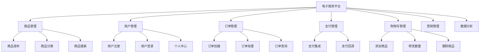
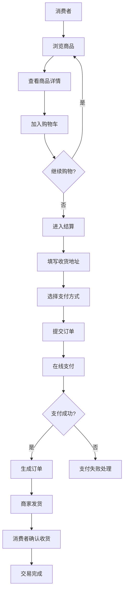
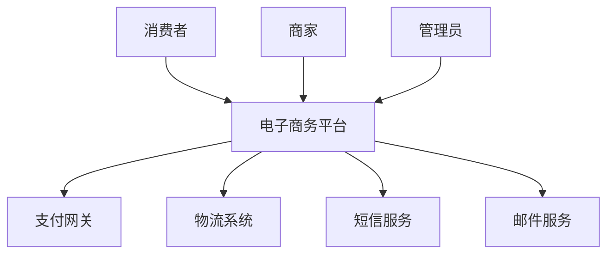
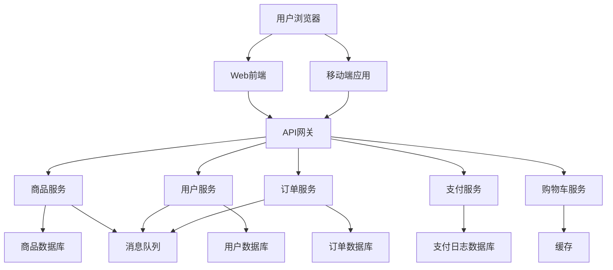
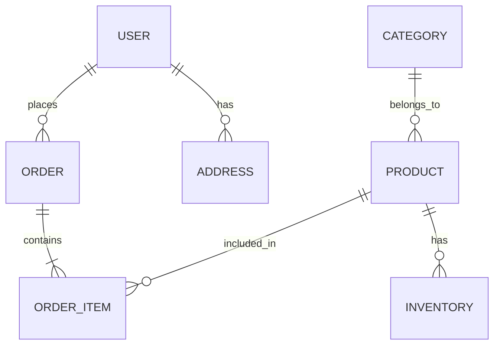
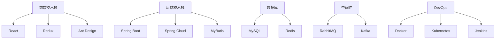

# 电子商务平台需求与系统分析示例

## 1. 项目概述

本案例展示了如何使用需求与系统分析技能模板来分析一个电子商务平台项目。该项目旨在创建一个面向B2C的电子商务平台，支持商品展示、用户管理、订单处理、支付集成等核心功能。

## 2. 需求收集与分析

### 2.1 项目背景
随着电子商务的快速发展，企业需要一个功能完整、用户体验良好的在线销售平台，以拓展市场份额、提高销售效率。

### 2.2 业务目标
- 在6个月内上线核心功能
- 实现10万注册用户
- 月交易额达到100万元
- 系统可用性达到99.9%

### 2.3 用户角色
| 角色 | 描述 | 主要职责 |
|------|------|----------|
| 消费者 | 平台的最终用户 | 浏览商品、下单、支付、查看订单 |
| 商家 | 商品提供者 | 发布商品、管理库存、处理订单 |
| 管理员 | 平台运营者 | 管理用户、商品审核、订单管理、数据统计 |

### 2.4 核心用户故事
| ID | 用户故事 | 验收标准 | 优先级 |
|----|----------|----------|--------|
| US001 | 作为消费者，我希望能够浏览商品列表，以便找到我需要的商品 | 1. 能够按分类浏览商品 2. 能够搜索商品 3. 能够查看商品详情 | 高 |
| US002 | 作为消费者，我希望能够将商品加入购物车，以便统一结算 | 1. 能够将商品加入购物车 2. 能够修改购物车中商品数量 3. 能够删除购物车中的商品 | 高 |
| US003 | 作为消费者，我希望能够在线支付订单，以便完成购买 | 1. 支持多种支付方式 2. 支付过程安全可靠 3. 支付后订单状态自动更新 | 高 |

## 3. 系统功能规划

### 3.1 功能分解树

### 3.2 核心业务流程

## 4. 非功能需求定义

### 4.1 性能需求
| 需求ID | 需求描述 | 验收标准 | 优先级 |
|--------|----------|----------|--------|
| PERF001 | 商品列表页响应时间 | 95%的请求响应时间<300ms | 高 |
| PERF002 | 订单创建响应时间 | 95%的请求响应时间<500ms | 高 |
| PERF003 | 系统吞吐量 | 每秒可处理500个并发请求 | 高 |
| PERF004 | 系统并发用户数 | 支持5000个并发用户在线 | 中 |

### 4.2 可靠性需求
| 需求ID | 需求描述 | 验收标准 | 优先级 |
|--------|----------|----------|--------|
| REL001 | 系统可用性 | 年度可用性达到99.9% | 高 |
| REL002 | 数据备份 | 每天自动备份数据，备份保留30天 | 高 |
| REL003 | 系统恢复能力 | 系统故障后30分钟内恢复正常运行 | 高 |

### 4.3 安全性需求
| 需求ID | 需求描述 | 验收标准 | 优先级 |
|--------|----------|----------|--------|
| SEC001 | 数据加密 | 敏感数据传输和存储均采用AES-256加密 | 高 |
| SEC002 | 支付安全 | 符合PCI DSS支付卡行业数据安全标准 | 高 |
| SEC003 | 访问控制 | 实现基于角色的访问控制(RBAC) | 高 |
| SEC004 | 防止SQL注入 | 所有数据库操作使用参数化查询 | 高 |

## 5. 系统架构设计

### 5.1 系统上下文图

### 5.2 容器图

### 5.3 数据模型设计

## 6. 技术选型评估

### 6.1 核心技术栈选型

| 技术类别 | 选型结果 | 选型理由 |
|----------|----------|----------|
| 前端框架 | React | 社区活跃，生态丰富，适合构建复杂单页应用 |
| 后端框架 | Spring Boot | 成熟稳定，适合构建微服务架构 |
| 数据库 | MySQL + Redis | MySQL用于持久化存储，Redis用于缓存 |
| 消息队列 | RabbitMQ | 成熟稳定，支持多种消息模式 |
| 支付集成 | 支付宝 + 微信支付 | 覆盖国内主要支付场景 |
| 部署方式 | Docker + Kubernetes | 便于容器化部署和管理 |

### 6.2 技术架构全景图

## 7. 项目实施路线规划

### 7.1 里程碑计划

| 里程碑ID | 里程碑名称 | 预计完成日期 | 主要交付物 |
|----------|------------|--------------|------------|
| MS001 | 需求分析完成 | 2024-03-31 | 需求规格说明书 |
| MS002 | 系统设计完成 | 2024-04-30 | 系统设计文档 |
| MS003 | 核心功能开发完成 | 2024-06-30 | 可运行的核心功能 |
| MS004 | 系统测试完成 | 2024-07-31 | 测试报告 |
| MS005 | 系统上线 | 2024-08-31 | 正式上线的系统 |

### 7.2 迭代计划概览

| 迭代 | 迭代周期 | 主要功能 |
|------|----------|----------|
| 迭代1 | 2024-04-01 至 2024-04-15 | 项目初始化、基础架构搭建 |
| 迭代2 | 2024-04-16 至 2024-04-30 | 用户管理功能开发 |
| 迭代3 | 2024-05-01 至 2024-05-15 | 商品管理功能开发 |
| 迭代4 | 2024-05-16 至 2024-05-30 | 购物车功能开发 |
| 迭代5 | 2024-06-01 至 2024-06-15 | 订单管理功能开发 |
| 迭代6 | 2024-06-16 至 2024-06-30 | 支付集成功能开发 |
| 迭代7 | 2024-07-01 至 2024-07-15 | 系统测试与bug修复 |
| 迭代8 | 2024-07-16 至 2024-07-31 | 系统优化与性能测试 |

### 7.3 资源分配

| 角色 | 人数 | 主要职责 |
|------|------|----------|
| 产品经理 | 1 | 需求分析、产品设计 |
| 前端开发 | 3 | Web前端和移动端开发 |
| 后端开发 | 4 | 微服务开发、API设计 |
| 测试工程师 | 2 | 功能测试、性能测试 |
| 运维工程师 | 1 | 系统部署、监控 |
| UI/UX设计师 | 1 | 界面设计、用户体验优化 |

### 7.4 风险评估与应对

| 风险ID | 风险描述 | 影响程度 | 应对策略 |
|--------|----------|----------|----------|
| R001 | 支付集成遇到问题 | 高 | 提前与支付网关提供商沟通，预留充足测试时间 |
| R002 | 系统性能不满足要求 | 中 | 进行性能测试，优化数据库查询和缓存策略 |
| R003 | 团队成员变动 | 中 | 文档化开发过程，进行知识共享 |
| R004 | 需求变更频繁 | 中 | 建立变更管理流程，严格控制变更范围 |

## 8. 结论

通过使用需求与系统分析技能模板，我们完成了对电子商务平台项目的全面分析。该分析涵盖了从需求收集到系统设计的各个方面，为项目的后续实施提供了清晰的指导。模板的结构化设计确保了分析过程的系统性和完整性，同时其灵活性使得我们能够根据项目的具体情况进行调整。

在实际项目中，我们可以根据需要进一步细化各个模块的内容，并结合项目的实际情况进行调整。通过持续的迭代和优化，我们可以确保最终的系统设计能够满足业务需求，并具有良好的可扩展性和可维护性。