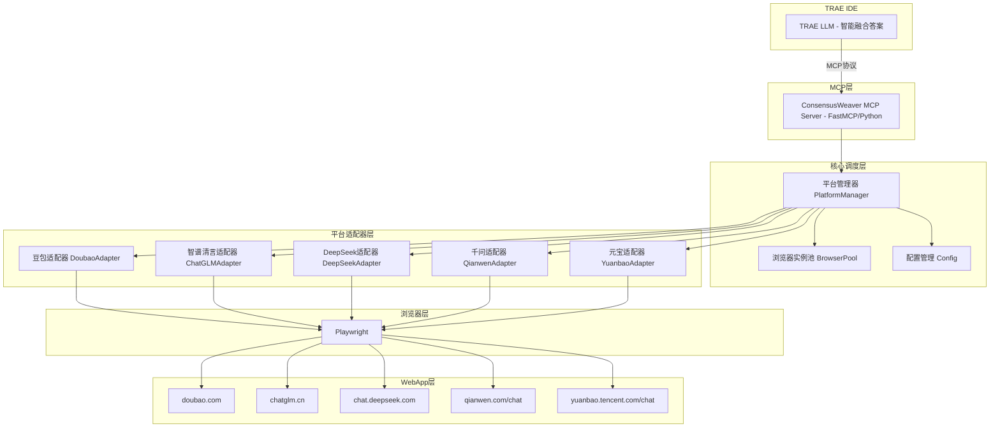
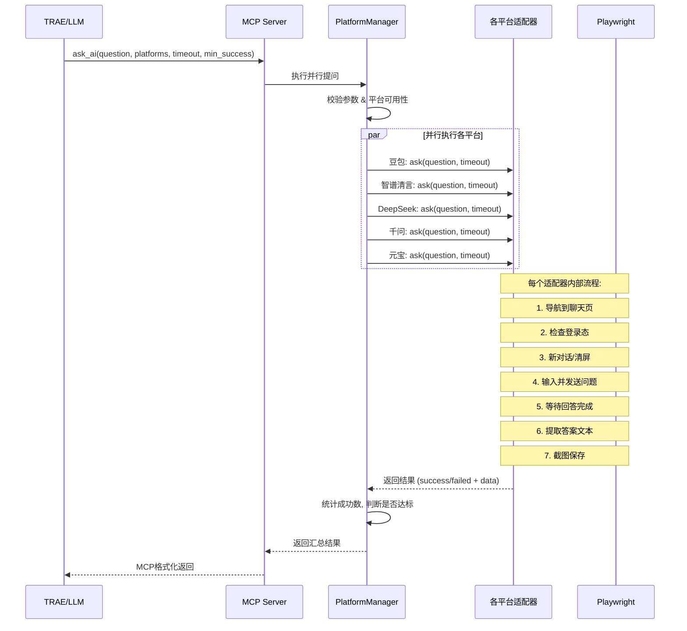
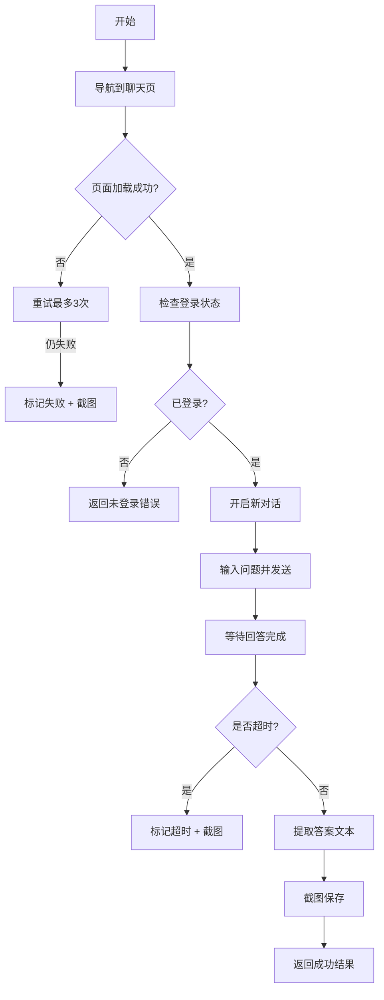
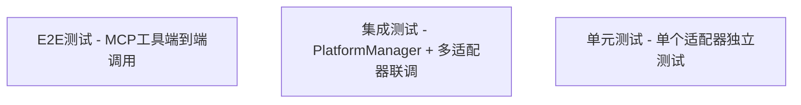

# ConsensusWeaver Agent 需求规格说明书

> 日期：2026-07-01
> 版本：v1.0
> 状态：待审核

## 一、项目概述

### 1.1 项目背景

ConsensusWeaver Agent 是一个基于 MCP（Model Context Protocol）的答案综合工具。它通过浏览器自动化技术，同时向多个 AI WebApp 提问，收集各平台的答案后返回给 LLM 进行智能融合，最终生成一份更全面、更可靠的综合答案。

### 1.2 核心目标

- **第一版（MVP）**：实现「并行询问 + 综合」模式，支持 5 个 AI WebApp 的并行提问与答案采集
- **后续扩展**：预留架构扩展能力，支持「串行迭代」「辩论共识」等更多模式

### 1.3 目标平台

第一版支持以下 5 个 AI WebApp：

| 平台 ID | 平台名称 | 网址 |
|---------|----------|------|
| doubao | 豆包 | https://www.doubao.com |
| chatglm | 智谱清言 | https://chatglm.cn |
| deepseek | DeepSeek | https://chat.deepseek.com |
| qianwen | 千问 | https://qianwen.com/chat |
| yuanbao | 元宝 | https://yuanbao.tencent.com/chat |

---

## 二、总体架构

### 2.1 架构选型

采用**平台适配器架构**，核心 MCP Server 负责调度和统一接口，每个 AI 平台一个独立的适配器模块，适配器之间完全解耦。



### 2.2 职责分层

| 层级 | 模块 | 核心职责 |
|------|------|----------|
| MCP层 | MCP Server | 暴露 MCP 工具接口，参数校验，结果格式化 |
| 核心调度层 | PlatformManager | 平台注册与发现、并发调度、结果汇总、错误统计 |
| | BrowserPool | 浏览器实例生命周期管理、用户数据目录管理 |
| | Config | 配置加载、校验、热更新 |
| 平台适配器层 | 各平台适配器 | 导航、登录检查、输入问题、等待回答、提取答案、截图 |
| 浏览器层 | Playwright | 浏览器自动化底层能力 |

### 2.3 设计原则

- **单一职责**：每个模块只做一件事，边界清晰
- **可扩展**：新增平台只需添加一个适配器文件，无需修改核心代码
- **可测试**：每个适配器可独立测试，核心调度层可单独验证
- **容错性**：单个平台失败不影响整体，支持最小成功数配置

---

## 三、MCP 工具接口

### 3.1 ask_ai — 核心提问工具

向指定的一个或多个 AI WebApp 并行提问，收集答案后返回。

**参数**：

| 参数名 | 类型 | 必填 | 默认值 | 说明 |
|--------|------|------|--------|------|
| `question` | string | 是 | - | 要提问的问题内容 |
| `platforms` | string[] | 否 | 全部平台 | 指定提问哪些平台，不传则全部 5 个 |
| `timeout` | number | 否 | 120 | 单个平台的超时时间（秒） |
| `min_success` | number | 否 | 3 | 最少成功数量，低于此数则整体失败 |

**返回结构**：

```json
{
  "success": true,
  "total_count": 5,
  "success_count": 4,
  "question": "问题内容",
  "results": [
    {
      "platform": "doubao",
      "platform_name": "豆包",
      "status": "success",
      "answer": "答案正文...",
      "duration_ms": 15230,
      "screenshot_path": "d:/.../doubao_20260701_xxxxxx.png",
      "error": null
    },
    {
      "platform": "chatglm",
      "platform_name": "智谱清言",
      "status": "failed",
      "answer": null,
      "duration_ms": 120000,
      "screenshot_path": "d:/.../chatglm_20260701_xxxxxx.png",
      "error": "超时：等待回答超时(120s)"
    }
  ]
}
```

### 3.2 list_platforms — 列出支持的平台

列出当前所有支持的 AI 平台及其可用状态。

**参数**：无

**返回结构**：

```json
{
  "platforms": [
    {
      "id": "doubao",
      "name": "豆包",
      "url": "https://www.doubao.com",
      "enabled": true,
      "login_status": "logged_in"
    }
  ]
}
```

### 3.3 check_login — 检查/准备登录状态

检查指定平台的登录状态，未登录时打开浏览器供用户手动登录。

**参数**：

| 参数名 | 类型 | 必填 | 默认值 | 说明 |
|--------|------|------|--------|------|
| `platform` | string | 是 | - | 平台 ID |
| `headless` | boolean | 否 | false | 是否无头模式（默认有头，便于用户登录） |
| `wait_login_seconds` | number | 否 | 0 | 等待用户手动登录的秒数。>0 时打开浏览器后等待指定秒数再检查登录状态；=0 时只检查不等待 |

**返回结构**：

```json
{
  "platform": "doubao",
  "is_logged_in": true,
  "message": "登录状态正常"
}
```

**登录状态判定方式**：

适配器通过以下方式综合判断是否已登录：
1. **DOM 元素检测**：页面上是否存在登录后才有的元素（如用户头像、用户名、聊天输入框等）
2. **URL 检测**：是否自动跳转到了登录页（如未登录访问聊天页会被重定向到登录页）
3. **Cookie 检测**：检查是否存在登录相关的关键 cookie（如 session、token 等）

以上至少满足 2 项才判定为已登录，避免误判。

**交互流程**：
1. 调用 `check_login(platform="doubao", wait_login_seconds=120)`
2. MCP Server 打开有头浏览器，导航到目标平台
3. 浏览器保持打开状态，用户在浏览器中手动完成登录
4. 等待 `wait_login_seconds` 秒后，自动重新检查登录状态
5. 返回最新登录状态结果

### 3.4 capture_screenshot — 截图调试

对指定平台的当前页面截图，用于调试。

**参数**：

| 参数名 | 类型 | 必填 | 默认值 | 说明 |
|--------|------|------|--------|------|
| `platform` | string | 是 | - | 平台 ID |

**返回结构**：

```json
{
  "platform": "doubao",
  "screenshot_path": "d:/.../debug_doubao_xxxxxx.png",
  "page_url": "https://www.doubao.com/chat/xxx"
}
```

---

## 四、平台适配器设计

### 4.1 适配器基类接口

所有适配器继承自 `BaseAdapter`，实现以下统一接口：

| 方法 | 参数 | 返回值 | 说明 |
|------|------|--------|------|
| `navigate_to_chat()` | 无 | None | 导航到聊天页面 |
| `check_login_status()` | 无 | bool | 检查是否已登录 |
| `send_question(question: str)` | question: 问题文本 | None | 输入并发送问题 |
| `wait_for_answer(timeout: int)` | timeout: 超时秒数 | str | 等待回答完成，返回答案文本 |
| `capture_screenshot(save_path: str)` | save_path: 保存路径 | str | 截图并返回保存路径 |
| `new_chat()` | 无 | None | 开启新对话 |
| `ask(question: str, timeout: int)` | question: 问题文本, timeout: 超时秒数 | AdapterResult | 完整提问流程封装（导航→登录检查→新对话→发送→等待→提取→截图） |

### 4.4 答案提取策略

各平台适配器优先采用 **DOM 选择器提取** 方式获取答案文本：

1. **定位最后一条 AI 消息气泡**：通过 CSS 选择器定位最新的 AI 回答元素
2. **判断回答是否完成**：
   - 检测输入框是否重新可用（发送按钮从禁用恢复为可用）
   - 检测消息气泡是否出现「停止生成」按钮消失/「复制」「重新生成」等操作按钮出现
   - 检测消息内容是否在 2 秒内无变化（内容稳定判定）
3. **提取纯文本**：获取元素的 innerText，保留换行和基础格式
4. **清理处理**：去除多余空行、末尾的「以上是...」等 AI 附加话术（如适用）

若 DOM 提取不稳定（如平台使用 Shadow DOM 或 Canvas 渲染），备选方案为**拦截网络请求**（拦截 API 响应获取完整回答内容）。各适配器在实现时根据实际情况选择最优方案，并在代码注释中说明。

### 4.5 新对话策略

`new_chat()` 方法的目标是确保下一次提问在**全新的上下文**中进行，不受历史对话影响。各平台根据自身 UI 特点选择实现方式：

- **优先方案**：点击平台的「新对话」/「新建聊天」按钮，进入新的空白对话
- **备选方案**：若新对话按钮不易定位，可刷新页面（利用持久化登录态，刷新后仍保持登录）
- **兜底方案**：以上都不行时，直接在当前对话继续提问，但调用方需注意上下文污染问题

### 4.6 适配器属性

| 属性 | 类型 | 说明 |
|------|------|------|
| `platform_id` | str | 平台唯一标识，如 "doubao" |
| `platform_name` | str | 平台显示名称，如 "豆包" |
| `base_url` | str | 平台首页/聊天页 URL |

### 4.3 浏览器实例管理策略

- **登录态持久化**：每个平台使用独立的用户数据目录（user data dir），保存 cookies 和本地存储
- **并行执行**：`ask_ai` 调用时，按请求的平台数量并行启动对应数量的浏览器上下文
- **复用策略**：首次调用启动浏览器，后续调用复用已有页面（新开聊天而非重启浏览器）
- **最大并行数**：默认 5 个（与平台数一致），可通过配置调整

---

## 五、核心流程

### 5.1 ask_ai 执行流程



### 5.2 单个适配器内部流程



---

## 六、错误处理

### 6.1 错误类型与处理策略

| 错误类型 | 处理方式 | 重试策略 |
|----------|----------|----------|
| 页面元素找不到 | 标记该平台失败，记录错误信息，保存截图 | 重试 3 次，间隔 1s |
| 导航超时 | 标记失败，保存截图 | 重试 2 次，间隔 2s |
| 回答生成超时（120s） | 标记失败，保存当前页面截图 | 不重试（回答生成是长耗时操作） |
| 未登录 | 标记失败，返回明确的"未登录"错误码 | 不重试，提示用户调用 check_login |
| 页面崩溃/浏览器异常 | 自动重启浏览器上下文 | 重试 1 次 |
| 网络异常 | 标记失败 | 重试 2 次，间隔 2s |

### 6.2 整体失败判定

- 成功数 >= `min_success`（默认 3）：整体 `success: true`
- 成功数 < `min_success`：整体 `success: false`，但仍返回各平台的详细结果

---

## 七、配置管理

### 7.1 配置文件结构

配置文件：`config.yaml`

```yaml
# 浏览器配置
browser:
  headless: true
  viewport_width: 1280
  viewport_height: 800
  slow_mo: 0
  user_data_base_dir: "./data/user_data"

# 平台配置
platforms:
  doubao:
    enabled: true
    name: "豆包"
    base_url: "https://www.doubao.com"
  chatglm:
    enabled: true
    name: "智谱清言"
    base_url: "https://chatglm.cn"
  deepseek:
    enabled: true
    name: "DeepSeek"
    base_url: "https://chat.deepseek.com"
  qianwen:
    enabled: true
    name: "千问"
    base_url: "https://qianwen.com/chat"
  yuanbao:
    enabled: true
    name: "元宝"
    base_url: "https://yuanbao.tencent.com/chat"

# 默认参数
defaults:
  timeout: 120
  min_success: 3
  max_concurrent: 5

# 路径配置
paths:
  screenshot_dir: "./data/screenshots"
  log_dir: "./data/logs"
```

---

## 八、项目结构

```
ConsensusWeaverAgent/
├── mcp_server.py              # MCP Server 入口，定义工具接口
├── config.yaml                # 配置文件
├── requirements.txt           # Python 依赖
├── README.md                  # 使用说明
├── .gitignore
│
├── core/                      # 核心调度层
│   ├── __init__.py
│   ├── platform_manager.py    # 平台管理器：注册、调度、并发控制
│   ├── browser_pool.py        # 浏览器实例池：生命周期管理
│   └── config.py              # 配置加载与管理
│
├── adapters/                  # 平台适配器层
│   ├── __init__.py
│   ├── base_adapter.py        # 适配器基类，定义统一接口
│   ├── doubao_adapter.py      # 豆包
│   ├── chatglm_adapter.py     # 智谱清言
│   ├── deepseek_adapter.py    # DeepSeek
│   ├── qianwen_adapter.py     # 千问
│   └── yuanbao_adapter.py     # 元宝
│
├── utils/                     # 工具层
│   ├── __init__.py
│   ├── screenshot.py          # 截图工具
│   └── logger.py              # 日志工具
│
├── data/                      # 运行数据（git忽略）
│   ├── user_data/             # 各平台浏览器用户数据
│   │   ├── doubao/
│   │   ├── chatglm/
│   │   ├── deepseek/
│   │   ├── qianwen/
│   │   └── yuanbao/
│   ├── screenshots/           # 截图保存目录
│   └── logs/                  # 日志目录
│
├── docs/
│   └── superpowers/
│       └── specs/
│           └── 2026-07-01-consensus-weaver-design.md
│
└── tests/                     # 测试
    ├── conftest.py            # pytest 配置与 fixtures
    ├── pytest.ini             # pytest 配置文件
    ├── unit/                  # 单元测试
    │   ├── test_base_adapter.py
    │   ├── test_doubao_adapter.py
    │   ├── test_chatglm_adapter.py
    │   ├── test_deepseek_adapter.py
    │   ├── test_qianwen_adapter.py
    │   └── test_yuanbao_adapter.py
    ├── integration/           # 集成测试
    │   ├── test_platform_manager.py
    │   └── test_browser_pool.py
    └── e2e/                   # E2E 测试
        └── test_mcp_tools.py
```

---

## 九、测试体系

### 9.1 测试分层

采用三层测试金字塔：



### 9.2 单元测试

**范围**：单个适配器的独立功能验证

**测试用例**：
- 导航到聊天页是否成功
- 登录状态检查（已登录/未登录两种场景）
- 发送问题功能
- 等待并提取答案（验证答案非空、格式正确）
- 新对话功能
- 截图功能

### 9.3 集成测试

**范围**：PlatformManager 与多个适配器的联调

**测试用例**：
- 单平台提问（验证调度流程）
- 多平台并行提问（验证并发、结果汇总）
- 部分平台失败场景（验证 min_success 逻辑）
- 全部失败场景（验证错误处理）
- 指定部分平台提问（验证 platforms 参数）
- 超时参数透传验证
- 平台可用性检查

### 9.4 E2E 测试

**范围**：MCP 工具层的完整调用链

**测试用例**：
- `ask_ai` 工具完整调用（真实问题 → 多平台 → 返回结果）
- `list_platforms` 工具调用
- `check_login` 工具调用
- `capture_screenshot` 工具调用
- 参数异常场景（空问题、不存在的 platform、非法 timeout）
- 返回结构完整性校验（字段齐全、类型正确）

### 9.5 测试辅助设施

| 设施 | 用途 |
|------|------|
| pytest fixtures | 管理浏览器生命周期、配置加载、适配器实例化 |
| 测试标记 | `@pytest.mark.slow` 标记慢测试（真实浏览器调用），可选择性跳过 |
| 测试配置 | 使用独立的测试数据目录，不污染生产数据 |
| 失败截图 | 测试失败时自动截图，便于排查 |
| 日志收集 | 测试运行时收集详细日志，失败时输出 |

---

## 十、技术选型

| 组件 | 选型 | 理由 |
|------|------|------|
| MCP 框架 | FastMCP (Python) | Python 技术栈匹配，FastMCP 简洁高效，符合 MCP 2.0 标准 |
| 浏览器自动化 | Playwright (Python) | API 现代化，反检测能力强，异步支持好 |
| 配置管理 | PyYAML | 简洁，易读易写 |
| 并发模型 | asyncio + async Playwright | 天然支持并行，IO 密集型场景效率高 |
| 测试框架 | pytest | 生态成熟，fixture 机制强大，参数化测试灵活 |

---

## 十一、开发路线

### 第一阶段：验证期（可行性验证）

1. 搭建项目骨架 + 配置管理 + 浏览器池
2. 实现适配器基类 + 第一个平台适配器（豆包）
3. 验证豆包全流程：导航 → 登录检查 → 提问 → 等回答 → 提取 → 截图
4. 依次实现剩余 4 个平台适配器
5. 实现 PlatformManager 并发调度
6. 封装 MCP Server，暴露 4 个工具
7. 联调测试

### 第二阶段：产品化（可选）

1. 完善错误处理和重试机制
2. 增加反检测措施
3. 完善测试覆盖率
4. 性能优化
5. 扩展更多模式（串行迭代、辩论共识）

---

## 十二、成功标准

- 5 个目标平台均能稳定完成「提问 → 获取答案」全流程
- 单平台平均响应时间 < 60 秒（不含答案生成时间）
- 并行执行 5 个平台时，总耗时 = 最慢平台耗时（而非 5 倍）
- 成功率：正常网络环境下，单次 ask_ai 调用 5 个平台至少 4 个成功
- MCP 工具调用返回结构稳定，字段完整
- 测试覆盖率：核心模块 >= 80%
